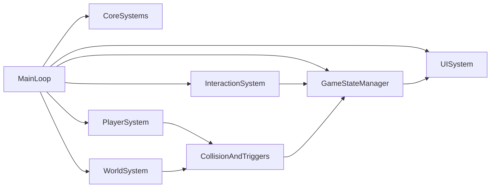
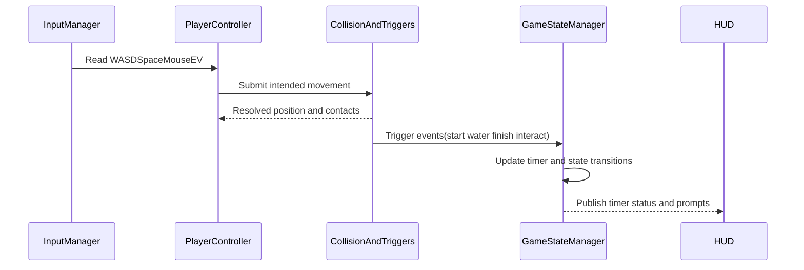
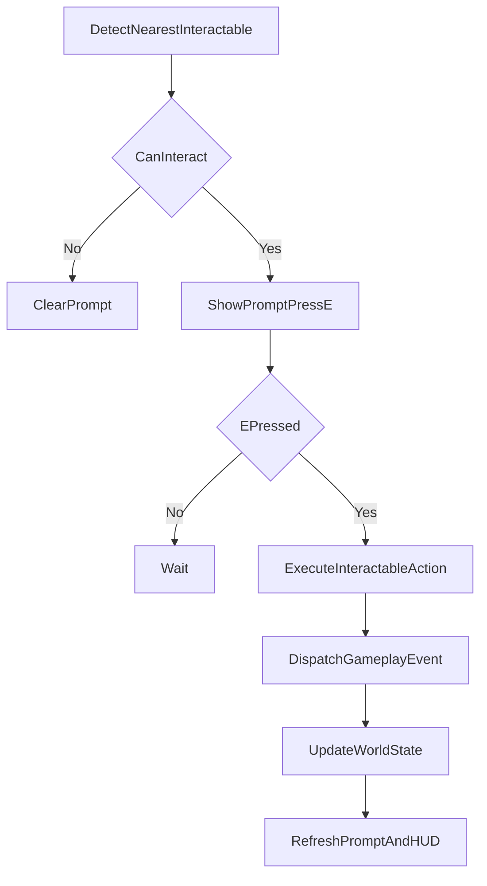

# Island Obstacle Speedrun Implementation Plan

## Scope And Source Of Truth

- Use the approved requirements from spec.md.
- Create implementation and project usage details in README.md.
- Deliver MVP first; stretch features (day/night, extra routes, best-time persistence) only after checklist completion.

## Proposed Project Architecture

- `src/main.ts`: App bootstrap, render loop, module wiring.
- `src/core/`: renderer, scene, camera manager, clock/time-step.
- `src/game/`: game state machine (`Idle`, `Running`, `Won`, `Respawning`), run timer, respawn logic.
- `src/player/`: player controller, input map, movement/jump physics, camera follow data.
- `src/world/`: island layout, spawn/finish/water trigger volumes, obstacle setup.
- `src/interactions/`: generic interactable interface + lever/button/throw target handlers.
- `src/obstacles/`: moving obstacle behaviors and collision proxies.
- `src/ui/`: HUD timer, win panel, prompts (`Press E`, camera mode).
- `src/assets/`: textures/models with loading helpers and fallback materials.

## Runtime Data And Control Flow

- Per-frame order: read input -> update player physics -> resolve collisions -> process triggers/interactions -> update timer/state -> render frame/UI.
- Keep trigger checks deterministic and centralized to avoid duplicate state transitions (e.g., win + respawn race).
- Use a single authoritative `RunContext` object for current time, checkpoint, and active interaction flags.

## Feature Implementation Phases

- Phase 1: Foundation
  - Scaffold TypeScript + Three.js app structure.
  - Build terrain, water plane, sky/light baseline.
  - Add first-person + third-person camera modes and toggle.
- Phase 2: Player And Traversal
  - Implement movement, jump, gravity, ground checks.
  - Add start spawn and respawn checkpoints.
  - Add water/out-of-bounds detection and teleport reset.
- Phase 3: Gameplay Core
  - Implement moving obstacle with rotation and collision.
  - Implement start/finish trigger volumes and bell win event.
  - Add run timer lifecycle (start, pause/stop at win, reset on restart).
- Phase 4: Interactions
  - Implement `Interactable` contract and interaction targeting.
  - Add lever/button mechanics that alter level path state.
  - Add basketball pickup + throw + hit-target trigger.
- Phase 5: UX And Polish
  - HUD timer, win summary, interaction prompts.
  - Texture pass for at least five distinct textured objects.
  - Lighting tuning for ambient/diffuse/specular readability.
- Phase 6: Validation And Packaging
  - Validate all acceptance criteria from spec checklist.
  - Test two-minute meaningful gameplay path.
  - Document controls/setup/deploy in README and publish to Vercel.

## Interaction Subsystem Design

- Define an `Interactable` interface with methods like `canInteract(player)`, `interact(context)`, `getPrompt()`.
- Raycast/proximity selection feeds a single active prompt in UI.
- Use event dispatch (`onLeverFlipped`, `onButtonPressed`, `onTargetHit`) to decouple gameplay logic from object scripts.

## Testing And Acceptance Strategy

- Functional playtests per feature phase (movement, camera toggle, timer, respawn, win).
- Collision test matrix: obstacle contact, water fall, out-of-bounds, trigger edges, repeated respawns.
- Interaction test matrix: each mechanic independently + chained progression route.
- Visual quality checks: textured object count, light behavior, camera clipping in both views.
- Final rubric mapping report in README showing where each requirement is satisfied.

## Risks And Mitigations

- Collision instability on moving objects -> use simple collision volumes and conservative step sizes.
- Camera clipping in third person -> add camera collision probe and min/max follow distance.
- Feature coupling across interactions -> enforce event-driven interfaces and keep level state centralized.
- Schedule drift -> lock MVP feature cutoff before stretch implementation.

